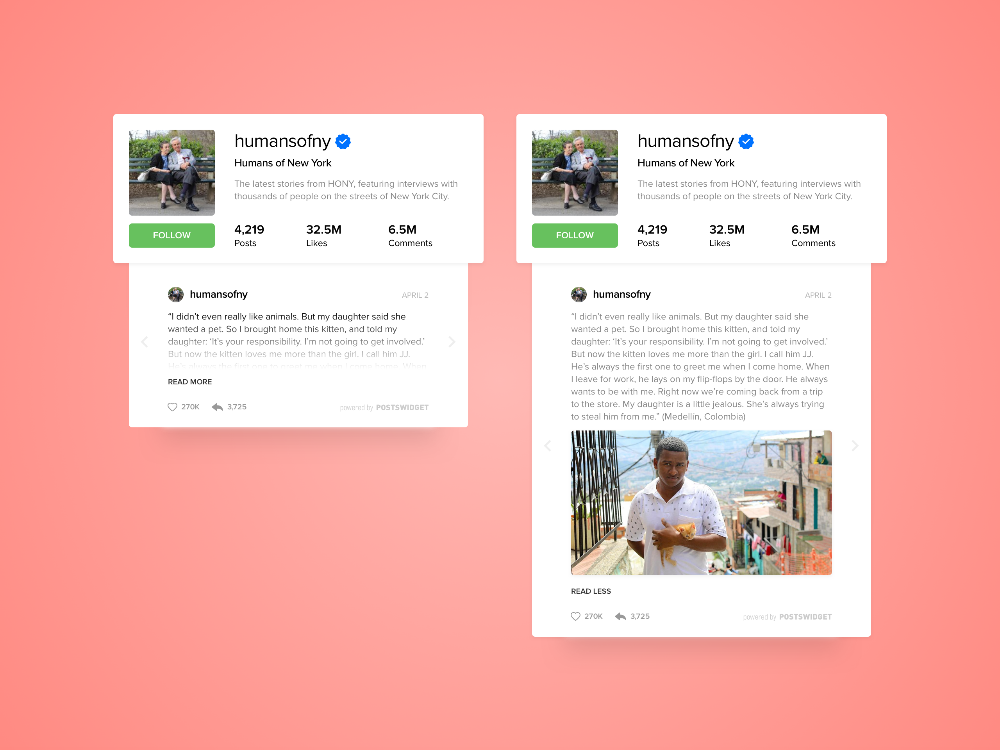

# Labo 01 - From mockup to HTML

The objective of this lab is to get familiar with HTML, CSS and bit of Javascript. Your task as a front-end developer is to integrate a widget concept provided by your companie's UX/UI department. 

https://dribbble.com/shots/3427269-Minimal-Profile-and-Posts-Widget

### Tasks

The mockup is divided into parts - the *profile widget*  at the top the *post widget*. 

1. Implement the *profile widget* **or** the *post widget* in a static web page. **It's not mandatory to implement both**.
2. Imagine a simple interaction and implement it with Javascript. For example users could toggle the follow button in the profile widget or even expand / collapse the post widget as shown in the picture.
3. When the implementation is finished, publish your prototype to a website and include the link to the website in your github repository.

